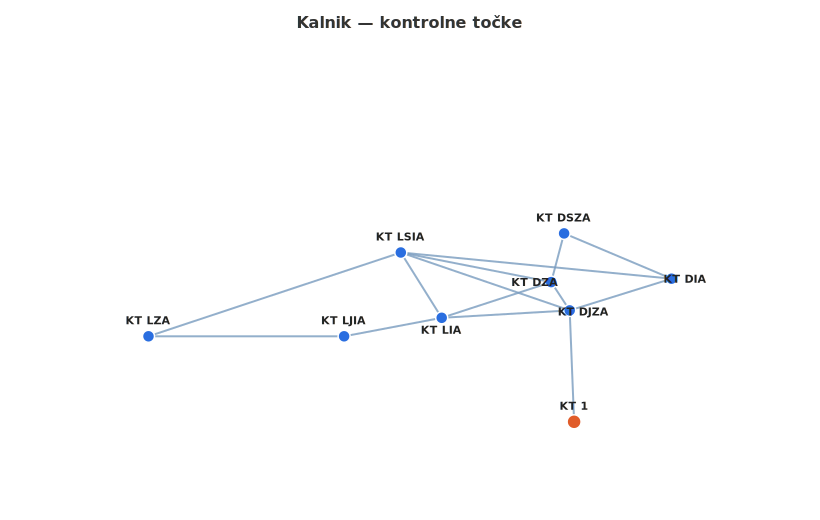

# Vježba orijentacije — Kalnik
## OPŠ PD Vrbovec

*Zajednički opis vježbe: vidi `vjezba_orijentacije.md`*

---

## Lokacija

Poligon se nalazi na **Kalniku**, u okolici sela Kalnik (Hrvatska).

---

## Organizacija

- **Preporučeni broj polaznika:** do 30 (3–5 po grupi)
- **Broj grupa:** 6

---

## Kontrolne točke

Koordinatni sustav: WGS-84.

| KT | Opis | WGS84 (DMS) | Decimalno |
|----|------|-------------|-----------|
| KT 1 | Groblje u selu Kalnik *(polazište)* | 46°7'40.81"N 16°28'2.19"E | 46.127997, 16.467275 |
| KT DJZA | Raskrižje staza *(čvorište — razdvojište i cilj)* | 46°7'56.35"N 16°28'1.32"E | 46.132319, 16.467033 |
| KT DIA | Raskrižje staza | 46°8'0.79"N 16°28'21.85"E | 46.133553, 16.472736 |
| KT DSZA | Raskrižje staza | 46°8'7.11"N 16°28'0.18"E | 46.135308, 16.466717 |
| KT DZA | Raskrižje staza *(čvorište)* | 46°8'0.31"N 16°27'57.78"E | 46.133419, 16.465994 |
| KT LSIA | Raskrižje staza | 46°8'4.44"N 16°27'27.25"E | 46.134567, 16.457569 |
| KT LZA | Raskrižje staza | 46°7'52.73"N 16°26'36.35"E | 46.131314, 16.443431 |
| KT LJIA | Vrh | 46°7'52.73"N 16°27'15.82"E | 46.131314, 16.454394 |
| KT LIA | Raskrižje staza | 46°7'55.32"N 16°27'35.49"E | 46.132033, 16.459858 |

---

## Struktura poligona

Poligon je **osmica** s dva čvorišta — **KT DJZA** (glavno, start/cilj) i **KT DZA**.

- **Desna petlja:** KT DJZA – KT DIA – KT DSZA – KT DZA
- **Lijeva petlja:** KT LSIA – KT LZA – KT LJIA – KT LIA
- **Veze između petlji (sve hodljive):** KT DJZA↔KT LSIA, KT DJZA↔KT LIA, KT DZA↔KT LSIA, KT DZA↔KT LIA
- **Dijagonalna veza:** KT DIA↔KT LSIA (koriste G5 i G6)

---

## Karta poligona

---

## Zajednički početak (sve grupe)

**KT 1 → KT DJZA** | Azimut: 358° | Udaljenost: 480 m

---

## Rute po grupama

Sve rute kreću i završavaju na **KT DJZA**. Duljine od KT DJZA ne uključuju zajednički početak (KT 1 → KT DJZA = 480 m).

G1↔G2, G3↔G4 i G5↔G6 su zrcalni parovi s identičnom ukupnom duljinom.

| Grupa | Ruta (od KT DJZA) | Ukupno od KT DJZA | Ukupno s početkom |
|-------|-------------------|:-----------------:|:-----------------:|
| G1 | DJZA→DIA→DSZA→DZA→LSIA→LZA→LJIA→LIA→DJZA | 4821 m | 5301 m |
| G2 | DJZA→LIA→LJIA→LZA→LSIA→DZA→DSZA→DIA→DJZA | 4821 m | 5301 m |
| G3 | DJZA→DIA→DSZA→DZA→LIA→LJIA→LZA→LSIA→DJZA | 4873 m | 5353 m |
| G4 | DJZA→LSIA→LZA→LJIA→LIA→DZA→DSZA→DIA→DJZA | 4873 m | 5353 m |
| G5 | DJZA→DZA→DSZA→DIA→LSIA→LZA→LJIA→LIA→DJZA | 5013 m | 5493 m |
| G6 | DJZA→LIA→LJIA→LZA→LSIA→DIA→DSZA→DZA→DJZA | 5013 m | 5493 m |

---

## Master tablica segmenata

Azimuti i udaljenosti izračunati Haversineovom formulom.

| Segment | Azimut | Udaljenost | Koriste grupe |
|---------|:------:|:----------:|---------------|
| KT 1 → KT DJZA | 358° | 480 m | sve |
| KT DJZA → KT DIA | 77° | 460 m | G1, G3 |
| KT DJZA → KT DZA | 324° | 216 m | G5 |
| KT DJZA → KT LSIA | 289° | 771 m | G4 |
| KT DJZA → KT LIA | 277° | 501 m | G2, G6 |
| KT DIA → KT DJZA | 253° | 460 m | G2, G4 |
| KT DIA → KT DSZA | 322° | 503 m | G6 |
| KT DIA → KT LSIA | 261° | 1174 m | G5 |
| KT DSZA → KT DIA | 113° | 503 m | G1, G3 |
| KT DSZA → KT DZA | 201° | 216 m | G2, G6 |
| KT DZA → KT DJZA | 144° | 216 m | G6 |
| KT DZA → KT DSZA | 14° | 216 m | G2 |
| KT DZA → KT LSIA | 281° | 501 m | G3 |
| KT DZA → KT LIA | 270° | 501 m | G1 |
| KT LSIA → KT DJZA | 109° | 771 m | G3, G5 |
| KT LSIA → KT LZA | 252° | 1148 m | G1, G5 |
| KT LSIA → KT LIA | 134° | 501 m | G2 |
| KT LZA → KT LSIA | 78° | 1148 m | G2, G6 |
| KT LZA → KT LJIA | 90° | 845 m | G4 |
| KT LJIA → KT LZA | 270° | 845 m | G1, G3 |
| KT LJIA → KT LIA | 79° | 429 m | G4 |
| KT LIA → KT DJZA | 97° | 501 m | G1, G3 |
| KT LIA → KT DZA | 72° | 501 m | G4 |
| KT LIA → KT LSIA | 314° | 501 m | G5 |
| KT LIA → KT LJIA | 259° | 429 m | G2, G6 |

---

## Generirani dokumenti

- `kartice_orijentacija_kalnik.docx` — kartice tečajaca (6 kartica, svaka na zasebnoj stranici)
- `organizator_kalnik.docx` — list organizatora

### Sadržaj kartica tečajaca

Svaka kartica sadrži:
1. Zaglavlje: naziv vježbe, OPŠ PD Vrbovec, broj grupe
2. Zajednički početak: KT 1 → KT DJZA (azimut 358°, 480 m)
3. Tablica segmenata rute: redni broj koraka, segment (od→do), azimut, udaljenost, opis odredišne KT
4. Popis KT-ova koje grupa skuplja

### Sadržaj lista organizatora

1. Koordinate svih KT-ova (WGS84 DMS + decimalni format)
2. Pregled svih ruta s ukupnim duljinama
3. Master tablica segmenata (azimut, udaljenost, koje grupe koriste)
4. Tablica preklapanja ruta (gdje se grupe mogu sresti)

---

## Napomene specifične za Kalnik

- Segment KT LSIA↔KT LZA je najduži (1148 m) i jednoznačan na terenu
- Segment KT DIA↔KT LSIA (1174 m) je dijagonala koju koriste samo G5 i G6 — vrijedi posebno naglasiti tim grupama
- KT LJIA je vrh — jedina KT koja nije raskrižje staza
- KT DJZA je i razdvojište i cilj (start svake grupne rute i povratak na kraju)
