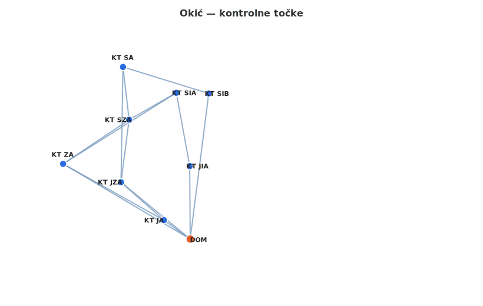

# Vježba orijentacije — Okić
## OPŠ PD Vrbovec

*Zajednički opis vježbe: vidi `vjezba_orijentacije.md`*

---

## Lokacija

Poligon se nalazi na **Okiću**, u okolici planinarskog doma Okić.

---

## Organizacija

- **Preporučeni broj polaznika:** do 20 (3–5 po grupi)
- **Broj grupa:** 4

---

## Kontrolne točke

| KT | Opis | WGS84 (DMS) | Decimalno |
|----|------|-------------|-----------|
| DOM | Planinarski dom *(start i cilj)* | 45°44'56.87"N 15°42'11.05"E | 45.749131, 15.703069 |
| KT JA | Raskrižje ceste i plan. staze 1 | 45°45'0.86"N 15°42'3.07"E | 45.750239, 15.700853 |
| KT JZA | Raskrižje plan. staze 1 i potoka | 45°45'8.91"N 15°41'50.05"E | 45.752475, 15.697236 |
| KT ZA | Raskrižje puta i ceste | 45°45'12.79"N 15°41'32.49"E | 45.753553, 15.692358 |
| KT SZA | Raskrižje plan. staze 1 i ceste | 45°45'22.13"N 15°41'52.52"E | 45.756147, 15.697922 |
| KT SA | Raskrižje plan. staze 1 i puta | 45°45'33.31"N 15°41'50.66"E | 45.759253, 15.697406 |
| KT SIA | Raskrižje ceste i puta | 45°45'27.84"N 15°42'6.83"E | 45.757733, 15.701897 |
| KT SIB | Raskrižje dvije ceste | 45°45'27.70"N 15°42'16.67"E | 45.757694, 15.704631 |
| KT JIA | Prelazak ceste preko potoka | 45°45'12.32"N 15°42'10.90"E | 45.753422, 15.703028 |

---

## Struktura poligona

Poligon je **jedna petlja** — sve grupe prolaze istim područjem, ali različitim podskupom KT-ova i djelomično različitim segmentima.

Svaka grupa obilazi **5 od 8 KT-ova** (+ DOM = 6 točaka, 5 segmenata po grupi).

- **G1 i G2** obilaze KT JZA (zapadna varijanta), ne KT ZA
- **G3 i G4** obilaze KT ZA (jugozapadna varijanta), ne KT JZA
- KT JZA i KT ZA nikada nisu u istoj grupi

**Pokrivenost KT-ova:**

| KT | G1 | G2 | G3 | G4 |
|----|:--:|:--:|:--:|:--:|
| KT JA | ✓ | | | ✓ |
| KT JZA | ✓ | ✓ | | |
| KT ZA | | | ✓ | ✓ |
| KT SZA | | ✓ | ✓ | |
| KT SA | ✓ | ✓ | | |
| KT SIA | | | ✓ | ✓ |
| KT SIB | ✓ | ✓ | | |
| KT JIA | | | ✓ | ✓ |

---

## Karta poligona

---

## Zajednički početak

Nema zajedničkog polazišnog segmenta — sve grupe kreću direktno iz **DOM**-a u različitim smjerovima.

---

## Rute po grupama

Sve rute kreću i završavaju na **DOM**.

| Grupa | Varijanta | Ruta | Ukupno |
|-------|-----------|------|:------:|
| G1 | KT JZA | DOM → KT JA → KT JZA → KT SA → KT SIB → DOM | 2888 m |
| G2 | KT JZA | DOM → KT JZA → KT SZA → KT SA → KT SIB → DOM | 2893 m |
| G3 | KT ZA | DOM → KT ZA → KT SZA → KT SIA → KT JIA → DOM | 2804 m |
| G4 | KT ZA | DOM → KT JA → KT ZA → KT SIA → KT JIA → DOM | 2805 m |

Raspon duljina: 89 m (2804–2893 m).

---

## Master tablica segmenata

| Segment | Azimut | Udaljenost | Koriste grupe |
|---------|:------:|:----------:|---------------|
| DOM → KT JA | 306° | 212 m | G1, G4 |
| DOM → KT JZA | 309° | 586 m | G2 |
| DOM → KT ZA | 301° | 966 m | G3 |
| KT JA → KT JZA | 312° | 375 m | G1 |
| KT JA → KT ZA | 299° | 755 m | G4 |
| KT JZA → KT SZA | 7° | 412 m | G2 |
| KT JZA → KT SA | 1° | 754 m | G1 |
| KT ZA → KT SZA | 56° | 519 m | G3 |
| KT ZA → KT SIA | 58° | 874 m | G4 |
| KT SZA → KT SA | 353° | 348 m | G2 |
| KT SZA → KT SIA | 60° | 355 m | G3 |
| KT SA → KT SIB | 107° | 587 m | G1, G2 |
| KT SIA → KT JIA | 170° | 487 m | G3, G4 |
| KT SIB → DOM | 187° | 960 m | G1, G2 |
| KT JIA → DOM | 180° | 477 m | G3, G4 |

---

## Generirani dokumenti

- `kartice_orijentacija_okic.docx` — kartice tečajaca (4 kartice, svaka na zasebnoj stranici)
- `organizator_okic.docx` — list organizatora

---

## Napomene specifične za Okić

- Za razliku od Kalnika, grupe ne obilaze sve KT — svaka posjećuje 5 od 8 KT-ova
- Nema zajedničkog polazišnog segmenta: grupe kreću direktno iz DOM-a u različitim smjerovima
- Najduži segment: DOM → KT ZA (966 m) — naglasiti grupama G3 i G4
- Najduži povratni segment: KT SIB → DOM (960 m) — naglasiti grupama G1 i G2
